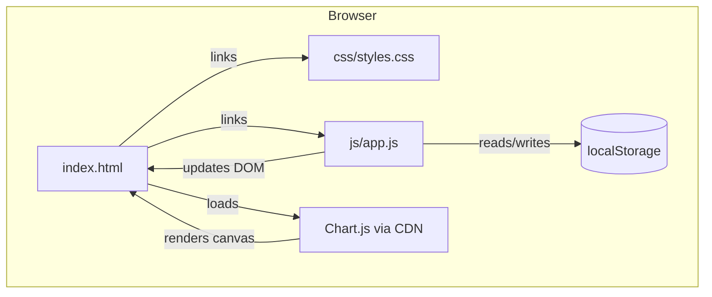

# Design Document: Expense & Budget Visualizer

## Overview

The Expense & Budget Visualizer is a single-page, zero-dependency web application (aside from Chart.js via CDN) that lets users record, view, and delete spending transactions, see a live running total balance, and understand their spending distribution through a pie chart. The entire application lives in three files: `index.html`, `css/styles.css`, and `js/app.js`. No build tooling, no server, and no frameworks are involved.

The application follows a straightforward **read-modify-write** cycle:

1. User interacts with the UI (add or delete a transaction).
2. The in-memory `transactions` array is updated.
3. The array is persisted to `localStorage`.
4. All reactive UI elements (Balance Display, Transaction List, Chart) are re-rendered from the updated array.

This unidirectional data flow keeps the logic simple and predictable.

---

## Architecture



### Module Responsibilities

| Module | File | Responsibility |
|---|---|---|
| Markup | `index.html` | Semantic HTML structure; CDN script tag for Chart.js |
| Styles | `css/styles.css` | Mobile-first responsive layout, component styles, state classes |
| Application Logic | `js/app.js` | State management, validation, DOM rendering, storage I/O, chart management |

### Rendering Strategy

All UI updates are **full re-renders** of their respective components driven by the single source of truth: the `transactions` array in memory. This avoids incremental patch bugs and keeps the code easy to reason about. Given the cap of ~500 transactions and the simplicity of each row, full re-renders are imperceptible to users.

---

## Components and Interfaces

### 1. HTML Structure (`index.html`)

```
<body>
  <div class="app-container">
    <header>
      <h1>Expense & Budget Visualizer</h1>
      <div id="balance-display"> … </div>       <!-- Requirement 3 -->
    </header>
    <main>
      <section class="form-section">
        <form id="transaction-form"> … </form>   <!-- Requirement 1 -->
      </section>
      <section class="chart-section">
        <canvas id="spending-chart"></canvas>     <!-- Requirement 4 -->
        <p id="chart-empty-state" hidden>…</p>
      </section>
      <section class="list-section">
        <ul id="transaction-list"></ul>           <!-- Requirement 2 -->
      </section>
    </main>
    <div id="toast-container" aria-live="polite"></div>  <!-- non-blocking messages -->
  </div>
</body>
```

**Design decision:** `<canvas>` stays in the DOM at all times. When there are no transactions the canvas is hidden and the empty-state `<p>` is shown instead — this avoids destroying and recreating the Chart.js instance on every toggle, which is a known source of Chart.js memory-leak bugs.

### 2. Input Form Component

**DOM elements:**
- `#item-name` — `<input type="text" maxlength="100">`
- `#amount` — `<input type="number" min="0.01" max="999999999.99" step="0.01">`
- `#category` — `<select>` with options Food / Transport / Fun (first option is a disabled placeholder)
- `#submit-btn` — `<button type="submit">`
- `#item-name-error`, `#amount-error`, `#category-error` — inline `<span>` error elements

**Interface (functions in `app.js`):**

```js
function validateForm(itemName, amount, category): ValidationResult
// Returns { valid: boolean, errors: { itemName?, amount?, category? } }

function handleFormSubmit(event): void
// Calls validateForm, creates transaction, persists, re-renders, resets form

function resetForm(): void
// Clears all fields and error spans within 300ms (per Req 1.7)
```

### 3. Transaction List Component

**DOM elements:**
- `#transaction-list` — `<ul>` rendered inside `<section class="list-section">`
- Each `<li>` contains: item name, formatted amount, category badge, delete button
- `#list-empty-state` — paragraph shown when list is empty (Req 2.8)

**Interface:**

```js
function renderTransactionList(transactions: Transaction[]): void
// Full re-render of #transaction-list from the transactions array

function handleDeleteClick(id: string): void
// Shows window.confirm dialog; on confirm calls deleteTransaction(id)

function deleteTransaction(id: string): void
// Removes from array, persists, re-renders list + balance + chart
```

### 4. Balance Display Component

**DOM elements:**
- `#balance-amount` — `<span>` inside the header; updated in-place

**Interface:**

```js
function renderBalanceDisplay(transactions: Transaction[]): void
// Recalculates total, formats it, updates DOM, toggles .negative class

function formatCurrency(value: number): string
// Returns e.g. "$1,234.56"; uses Intl.NumberFormat where available,
// falls back to manual formatting for older Safari versions
```

**Design decision:** The balance is always the sum of all transaction amounts. Negative totals are visually distinguished with a `.negative` CSS class (red colour) rather than a separate UI element, keeping the layout stable.

### 5. Pie Chart Component

**DOM elements:**
- `#spending-chart` — `<canvas>`
- `#chart-empty-state` — `<p>` (shown when no transactions, canvas hidden)

**Interface:**

```js
let chartInstance = null;  // module-level singleton

function renderChart(transactions: Transaction[]): void
// If no transactions: hides canvas, shows empty state
// Otherwise: shows canvas, hides empty state,
//   destroys old chartInstance if exists, creates new Chart(...)

function getCategoryTotals(transactions: Transaction[]): CategoryTotals
// Returns { Food: number, Transport: number, Fun: number }
```

**Design decision:** Chart.js is destroyed and re-created on each update rather than using `.update()`. This is simpler and avoids animation glitches when segments appear or disappear. Performance is acceptable because chart re-creation is bounded by user interaction rate (not tight loops).

**Category colours (fixed, Req 4.5):**
- Food: `#cf4646`
- Transport: `#cf8146`
- Fun: `#cfb146`

### 6. Storage Module

**Interface:**

```js
const STORAGE_KEY = 'expense_tracker_transactions';

function loadTransactions(): Transaction[]
// Reads localStorage[STORAGE_KEY], JSON.parses, validates shape
// On any error: shows toast warning, returns []

function saveTransactions(transactions: Transaction[]): void
// JSON.stringifies and writes to localStorage
// On QuotaExceededError or other error: shows toast error,
// does NOT revert in-memory state (Req 5.5)
```

### 7. Toast / Notification Component

```js
function showToast(message: string, type: 'warning' | 'error'): void
// Appends a toast <div> to #toast-container
// Auto-dismisses after 4 seconds
// Screen-reader accessible via aria-live="polite"
```

---

## Data Models

### Transaction Object

```js
/**
 * @typedef {Object} Transaction
 * @property {string}  id        - Unique identifier (crypto.randomUUID() with Date.now() fallback)
 * @property {string}  itemName  - Non-empty description, max 100 chars
 * @property {number}  amount    - Positive number 0.01–999999999.99
 * @property {string}  category  - One of "Food" | "Transport" | "Fun"
 * @property {number}  createdAt - Unix timestamp (ms) for ordering
 */
```

### ValidationResult Object

```js
/**
 * @typedef {Object} ValidationResult
 * @property {boolean} valid
 * @property {{ itemName?: string, amount?: string, category?: string }} errors
 */
```

### CategoryTotals Object

```js
/**
 * @typedef {Object} CategoryTotals
 * @property {number} Food
 * @property {number} Transport
 * @property {number} Fun
 */
```

### In-Memory State

The entire application state is a single module-level variable:

```js
let transactions = []; // Transaction[]
```

All other values (balance total, category totals, chart data) are derived from this array on demand. There is no additional state to synchronise.

### Storage Format

The `transactions` array is serialised as a JSON array directly:

```json
[
  { "id": "…", "itemName": "Lunch", "amount": 12.50, "category": "Food", "createdAt": 1720000000000 },
  …
]
```

**Validation on load:** After `JSON.parse`, the app checks that the result is an Array and that each element has `id` (string), `itemName` (non-empty string), `amount` (positive number), `category` (one of the three allowed values), and `createdAt` (number). Any malformed entry causes the entire payload to be discarded and replaced with `[]`, triggering the warning toast (Req 5.4).

---

## Correctness Properties

*A property is a characteristic or behavior that should hold true across all valid executions of a system — essentially, a formal statement about what the system should do. Properties serve as the bridge between human-readable specifications and machine-verifiable correctness guarantees.*

### Property 1: Form validation rejects all whitespace/empty item names

*For any* string composed entirely of whitespace characters (including the empty string) supplied as `itemName`, `validateForm` SHALL return `valid: false` and include an `itemName` error, leaving the transaction list unchanged.

**Validates: Requirements 1.2, 1.3**

---

### Property 2: Form validation rejects out-of-range amounts

*For any* numeric value that is ≤ 0, NaN, or > 999,999,999.99 supplied as `amount`, `validateForm` SHALL return `valid: false` and include an `amount` error, leaving the transaction list unchanged.

**Validates: Requirements 1.2, 1.4**

---

### Property 3: Adding a valid transaction grows the list by exactly one

*For any* transaction list state and any valid `(itemName, amount, category)` triple, calling `handleFormSubmit` with that data SHALL result in the transaction array length increasing by exactly one, and the new entry SHALL appear in the rendered `#transaction-list`.

**Validates: Requirements 1.6, 2.3**

---

### Property 4: Balance equals the sum of all transaction amounts

*For any* collection of transactions, `renderBalanceDisplay` SHALL display a value equal to the arithmetic sum of all `amount` fields, formatted to exactly 2 decimal places with a currency symbol.

**Validates: Requirements 3.1, 3.4, 3.5**

---

### Property 5: Storage round-trip preserves transaction data

*For any* valid array of transactions, calling `saveTransactions` followed by `loadTransactions` SHALL return an array that is deeply equal to the original (same `id`, `itemName`, `amount`, `category`, `createdAt` for every entry, in the same order).

**Validates: Requirements 5.1, 5.2, 5.3**

---

### Property 6: Chart category totals equal sum of matching transactions

*For any* collection of transactions, `getCategoryTotals` SHALL return totals where each category's value equals the sum of `amount` for all transactions whose `category` matches that key, and transactions with `amount ≤ 0` SHALL be excluded.

**Validates: Requirements 4.1, 4.6**

---

### Property 7: Deleting a transaction produces a list without that entry

*For any* transaction list containing a transaction with a given `id`, calling `deleteTransaction(id)` SHALL result in the transactions array containing no entry with that `id`, and the rendered list SHALL not display it.

**Validates: Requirements 2.5, 2.6, 2.7**

---

### Property 8: Currency formatter output is valid for any non-negative number

*For any* non-negative finite number, `formatCurrency` SHALL return a string that starts with a currency symbol, contains exactly one decimal separator, and has exactly two digits after the decimal.

**Validates: Requirements 3.5, 3.4**

---

## Error Handling

| Scenario | Detection point | Recovery |
|---|---|---|
| `localStorage` unavailable (private mode, quota full) | `saveTransactions` catches `SecurityError` / `QuotaExceededError` | Show error toast; in-memory state retained (Req 5.5) |
| Malformed JSON in `localStorage` | `loadTransactions` catches `JSON.parse` exception | Show warning toast; start with empty array (Req 5.4) |
| Structurally invalid stored data | `loadTransactions` post-parse validation | Show warning toast; start with empty array (Req 5.4) |
| `localStorage` entirely unavailable | `loadTransactions` catches `SecurityError` on read | Show browser-unsupported message (Req 7.3) |
| `Canvas` API unavailable (Chart.js prerequisite) | Feature-detect `!!HTMLCanvasElement` on init | Show browser-unsupported message (Req 7.3) |
| Chart.js CDN load failure | `window.onerror` or `Chart` undefined check on init | Show error toast; hide chart section gracefully |
| Form submitted with invalid data | `validateForm` returns errors | Inline error messages on form; submission blocked |
| Delete button pressed | `window.confirm` dialog | Transaction removed only on explicit confirmation |

**Error message strategy:** Non-blocking toast notifications (auto-dismiss in 4 s) are used for storage errors to avoid blocking the user's workflow. Inline form validation messages are used for input errors to provide immediate, contextual feedback. The browser-unsupported message is a static banner (not dismissible) since the app cannot function without the required APIs.

---

## Testing Strategy

### Overview

The app uses a dual approach: **unit/example-based tests** for specific behaviour and edge cases, and **property-based tests** for universal correctness guarantees. Since the core logic lives in pure or near-pure functions (`validateForm`, `formatCurrency`, `getCategoryTotals`, serialisation round-trips), property-based testing is well-suited here.

### Property-Based Testing

**Library:** [fast-check](https://github.com/dubzzz/fast-check) (runs in Node.js with jsdom, no browser required)

**Configuration:** Minimum 100 iterations per property test.

**Tag format:** Each test is tagged with a comment:
```
// Feature: expense-budget-visualizer, Property N: <property_text>
```

Properties to implement as PBT tests:

| Property | Test | Arbitrary |
|---|---|---|
| 1 — Whitespace item name rejection | `fc.string()` filtered to all-whitespace | Pass to `validateForm`; assert `valid === false` |
| 2 — Out-of-range amount rejection | `fc.oneof(fc.float({ max: 0 }), fc.constant(NaN))` | Pass to `validateForm`; assert `valid === false` |
| 3 — Adding transaction grows list by 1 | `fc.array(validTransaction)`, `fc.record(validInput)` | Call add logic; assert `length === prev + 1` |
| 4 — Balance equals sum | `fc.array(validTransaction, { minLength: 0, maxLength: 500 })` | Call sum logic; assert formatted output matches |
| 5 — Storage round-trip | `fc.array(validTransaction)` | save → load; deep equal |
| 6 — Category totals correctness | `fc.array(validTransaction)` | `getCategoryTotals`; assert per-category sums |
| 7 — Delete removes only target | `fc.array(validTransaction, { minLength: 1 })` | pick random id, delete; assert absent |
| 8 — Currency formatter validity | `fc.float({ min: 0, noNaN: true, noDefaultInfinity: true })` | call `formatCurrency`; assert regex `^\$[\d,]+\.\d{2}$` |

### Unit / Example-Based Tests

- **Form validation happy path:** valid inputs produce `valid: true`
- **Form reset:** after a successful submission, all fields are empty/unselected
- **Empty state messages:** rendered when `transactions === []`
- **Negative balance styling:** `.negative` class added when total < 0
- **Toast appearance and auto-dismiss:** toast added to DOM, removed after 4 s
- **Browser unsupported message:** shown when `localStorage` or `Canvas` is unavailable

### Integration Tests (manual / browser)

- Open `index.html` directly in Chrome, Firefox, Edge, Safari — verify no console errors
- Add 5 transactions across all three categories → confirm chart segments, balance, list
- Refresh page → confirm data persists
- Delete all transactions → confirm empty states shown for list and chart
- Resize viewport through 320 px → 1920 px → confirm no horizontal scroll

### Accessibility

- All form inputs have associated `<label>` elements
- Error spans are linked to inputs via `aria-describedby`
- Toast container uses `aria-live="polite"` for screen-reader announcements
- Delete buttons include `aria-label="Delete <itemName>"` for clarity
- Minimum tap target size 44 × 44 CSS px enforced via CSS `min-height` / `min-width`
